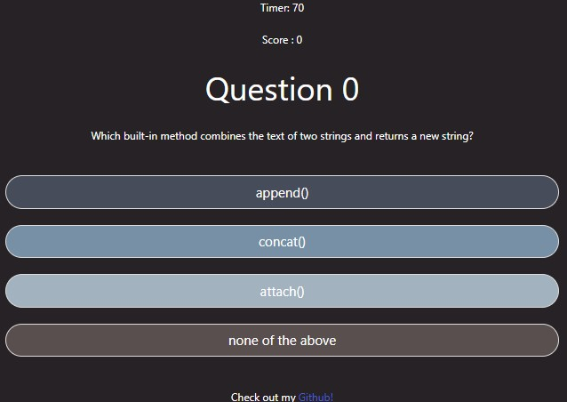

# Code Quiz

## Project Description
This is a Javascript quiz that I built to complete the Unit 4 challenge of the UT Austin coding bootcamp. The purpose of the project was to use all of the skills that we learned during Unit 4. The App is a game that will test your knowledge of the Javascript programing language. Please enjoy!

## How to Use This Project
1) Go to https://adamwagh512.github.io/codequiz/
2) Click the start quiz button to begin the quiz or the leadboard button to view the leaderboard (currently not working properly)

3) Answer the questions using the buttons as shown below. Answering the questions correctly will award you 10 points. Answering incorrectly will deduct 10 seconds from your timer. Either way you will get an alert.

4) Save your score and see if you made the leaderboard (also currently not working)

## Credits
I would like to sincerely thank Sara Baqla for her invaluable help during this project. A link to her Github is listed below.
https://github.com/missatrox44
I would also like to the following websites because I took my code quiz questions directly from them.
Tutorials Point: https://www.tutorialspoint.com/javascript/javascript_online_quiz.htm
GeeksforGeeks: https://www.geeksforgeeks.org/javascript-course-quiz-1/

Technologies Used:
Bulma 
Jquery

## License
MIT License

Copyright (c) 2022 adamwagh512

Permission is hereby granted, free of charge, to any person obtaining a copy
of this software and associated documentation files (the "Software"), to deal
in the Software without restriction, including without limitation the rights
to use, copy, modify, merge, publish, distribute, sublicense, and/or sell
copies of the Software, and to permit persons to whom the Software is
furnished to do so, subject to the following conditions:

The above copyright notice and this permission notice shall be included in all
copies or substantial portions of the Software.

THE SOFTWARE IS PROVIDED "AS IS", WITHOUT WARRANTY OF ANY KIND, EXPRESS OR
IMPLIED, INCLUDING BUT NOT LIMITED TO THE WARRANTIES OF MERCHANTABILITY,
FITNESS FOR A PARTICULAR PURPOSE AND NONINFRINGEMENT. IN NO EVENT SHALL THE
AUTHORS OR COPYRIGHT HOLDERS BE LIABLE FOR ANY CLAIM, DAMAGES OR OTHER
LIABILITY, WHETHER IN AN ACTION OF CONTRACT, TORT OR OTHERWISE, ARISING FROM,
OUT OF OR IN CONNECTION WITH THE SOFTWARE OR THE USE OR OTHER DEALINGS IN THE SOFTWARE.